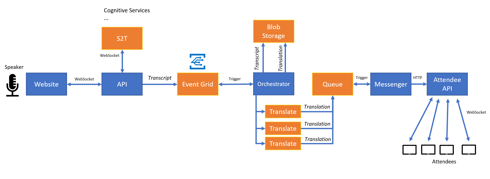

# V2T2L
"Voice to Text to Language" - solution for live conference translations. Modular, scalable, powered by Microsoft Azure.

## Scenario

We have built this prototype in cooperation with Newton Technologies. The goal is to provide a solution for near real-time conference transcription & translation.

1. English speaker is giving a presentation.
2. Our application streams voice from microphone to the cloud.
3. Cloud backend gets transcript (textual representation) of the speech.
4. Cloud backend also translates this transcript to multiple languages (currently 3).
5. Users (audience) subscribe to language of their choice on their devices (phones, tablets, laptops...).
6. Users get translated sentences as the speaker carries on with their talk.

The solution currently supports English speakers, but is designed in a way that any other language can be processed as well (by employing different speech-to-text provider).

## Architecture

Cornerstone of this solution is [Speech to Text API](https://azure.microsoft.com/en-us/services/cognitive-services/speech-to-text/), which is part of [Microsoft Cognitive Services](https://azure.microsoft.com/en-us/services/cognitive-services/).

Technology used:

* **JavaScript** - client applications for speakers & attendees
* **SignalR** - WebSocket communication
* **ASP.NET Core** - web APIs
* **Cognitive Services** - speech to text
* **Blob Storage** - storing of transcripts & translations
* **Storage Queues** - decoupling backend communication
* **Azure Functions** - orchestration of translations, sending results to attendees
* **Microsoft Translator** - translation to various languages, with neural networks (where possible)

## Limitations

In its current state, the solution works from start to end. There are a few limitations though.

* Backend processing sometimes takes around 10 seconds, which will be optimized by eliminating queues and using Event Grid.
* Speech to text ends after approximately 10 minutes, due to the limitation of S2T service. We are investigating possible workarounds.
* S2T services sometimes collects multiple sentences before returning a result which results in long delays between spoken word and translation. We are investigating different strategies how to address this.